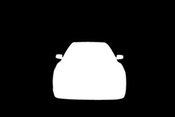

***
# Introduction

To accomplish this task, it was chosen the Carvana dataset from the [Carvana Image Masking Challenge](https://www.kaggle.com/c/carvana-image-masking-challenge) competition. It attempts to remove the studio background from the cars pictures as seen bellow:




A good approach to measure the algorithm performance in Semantic Segmentation Task is the [Dice coefficient](https://en.wikipedia.org/wiki/S%C3%B8rensen%E2%80%93Dice_coefficient) metric. Which is used during the training process, and implemented in the [helpers](./helpers.py) script.

The DeepNet used to perform segmentation was [U-Net](https://en.wikipedia.org/wiki/U-Net).

***
# Usage

This project allows you to train UNets and to predict masking images with the trained models.

To start the training is needed to download the `train` and `train_masks` folder from [here](https://www.kaggle.com/c/carvana-image-masking-challenge/data). Put both folders in the same directory and assign the path to the environment variable `CARVANA_DATASET`.

To start training, use the command:

```
mlflow run . -e train -P optimizer=adam -P epochs=20 -P batch_size=8
```

The parameteres `optimizer`, `epochs` and `batch_size` can be manipulated by the user. Optimizer can assume the values [`sgd`, `rmsprop`, `adam`, `adamax`, `adadelta`, `nadam`, `adagrad`]. 

To verify the experiment results, run:
```
mlflow ui
```

The command above presents an user interface in `localhost:5000`  with the parameters and metrics from the experiments. It reads the information stored in the `mlruns` folder.


To predict with the models, you need the `URI` from the experiments, check them in the user interface. Bellow you can see an example of the command.

```
mlflow run . -e  predict -P uri=91bdb9954fce4d6c8d49848880b1213e -P imgpath=$CARVANA_DATASET/train/00087a6bd4dc_01.jpg
```

This command plots the original and the predicted masked images side by side.
